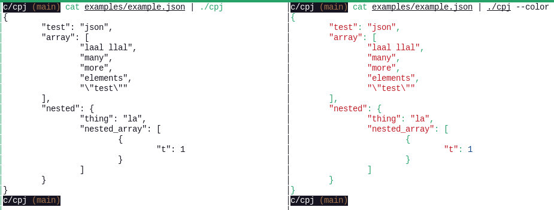

# cpj

cpj - c pretty json

This is a commandline tool to format (correct) input json in a more pretty format.

## How to

Compile the program. Use which ever c-compiler you want. Eg

```sh
cc cpj.c -o cpj
```

You can try it out by running the examples.

```sh
cat examples/example.json | ./cpj
cat examples/poke.json | ./cpj
```

To add some color to the output, use flag `--color`.

```sh
cat examples/example.json | ./cpj --color
cat examples/poke.json | ./cpj --color
```



## Notes

* MAYBE: Handle links as different colors when `--color` is used
* MAYBE: add help flag to the program.

### Buffered version

At first I did a [buffered version](depr/cpj_with_buffer.c).
When checking/testing the speed, I discovered, that smaller buffer gave better speed, contrary to my expectation.
So for testing purposes, I did one version using `putchar`.
Since that version worked better and had simpler code, I promoted this to the main version and deprecated the buffered one.

## Author

Meelis Utt
